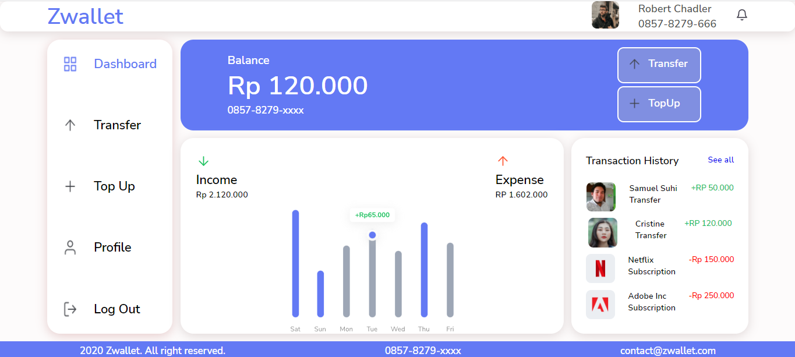
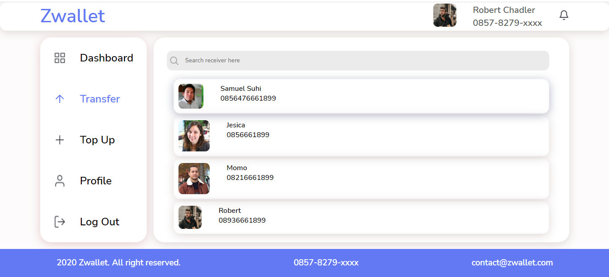

<br />
<p align="center">
<div align="center">
  
</div>

Zwallet is a digital wallet application built using HTML5 & CSS3. This application provides features for top up, transfer, show history, profile update, change password, create pin, update pin, etc. This application also provides two top up methods, which is using payment gateway or normal tranfsfer.

### Built With
- [HTML5]
- [CSS3]
- and other

### Installation

- Clone This Front End Repo
```
git clone https://github.com/MuhDRifai/fullstackweb-5.git
```
- Go To Folder Repo
```
cd zwallet
```

<!-- ROADMAP -->
## Screenshots

<div align="center">
  
  
   
  
  
   
  
</div>